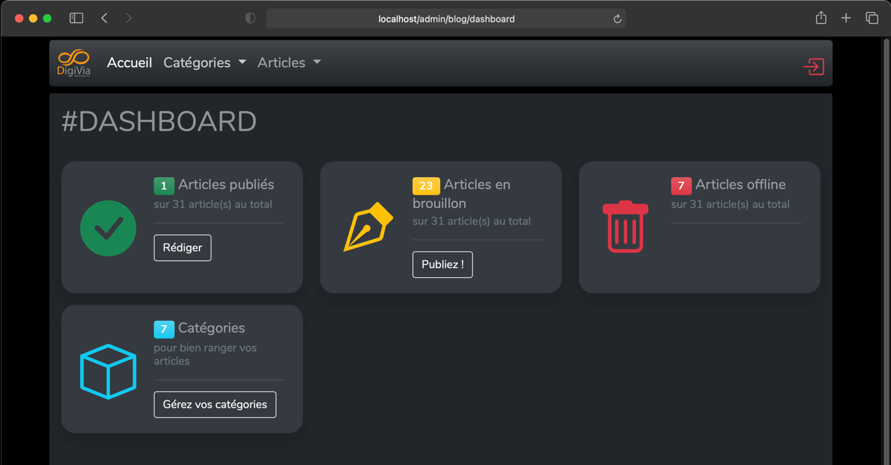
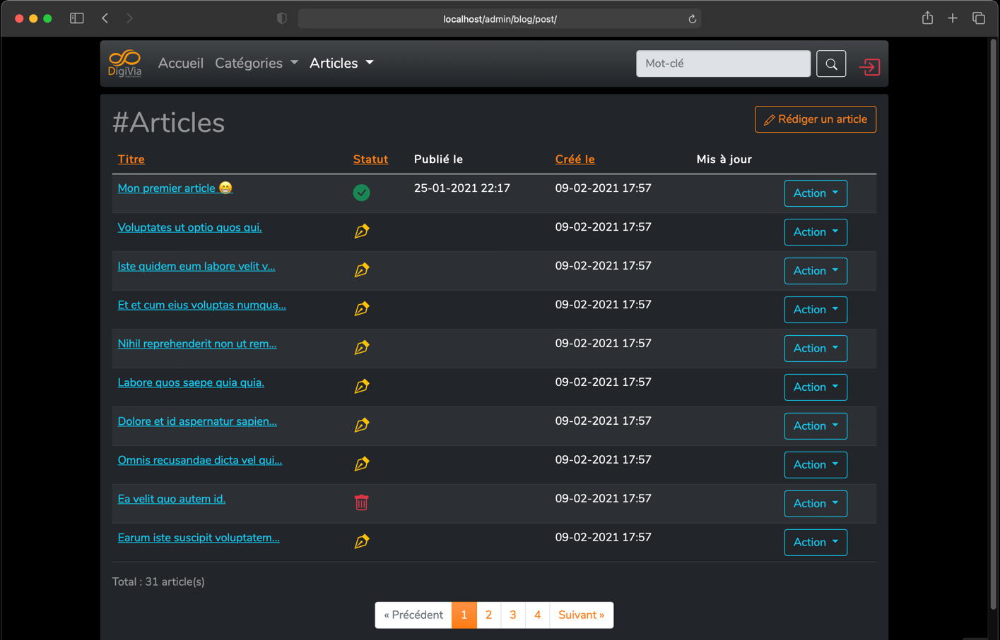
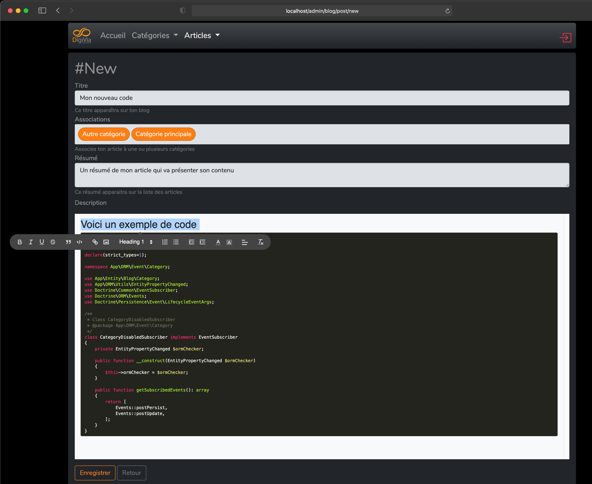

Digivia Blog Projet
===================

Aim
---

Not having found a simple tool to create articles and associate them with categories, I decided to create one.
I tested a few tools, like WordPress and others, which I was not satisfied with.
I wanted to create an API First application that allows headless management.
Development is still in progress, please be indulgent.
The technical stack is based on the Symfony 5 framework, which for me is the most suitable php framework for this type of project.
It is possible to run the app on docker, everything is provided. There is also a Makefile which allows you to automate certain actions. 

Screenshots
-----------






Setup
-----

Clone the projet. Open a terminal window, and type :
```
make build
```
It will build Docker images for your

After that, you can type 
```
make install
```
It will run DB migrations, and load fixtures

Now, you can open your favorite browser, and go to http://localhost/admin 

You can connect with this credentials :
login : admin@localhost.me
password : azerty

Customize
---------

You can customize the templates, everything is planned for that. In the project's templates / themes folder, you will find 2 sub-folders: admin and front.
Inside, the basic templates are stored in the "default" folder. You can add your modified templates (same name) in the "custom" folder. You will be able to completely customize the application. 

Assets
------

For the front part, I chose to go with vanilla js, and for the styles, I rely on Bootstrap5, because it got rid of jQuery. I then customized the styles and added what I needed. Everything is tidy in the assets directory.
Everything is built using Webpack Encore (thanks Symfony!).
I use awesome external libs, like [Quill](https://quilljs.com), [HighlightJs](https://highlightjs.org), [Choice.Js](https://joshuajohnson.co.uk/Choices/).

